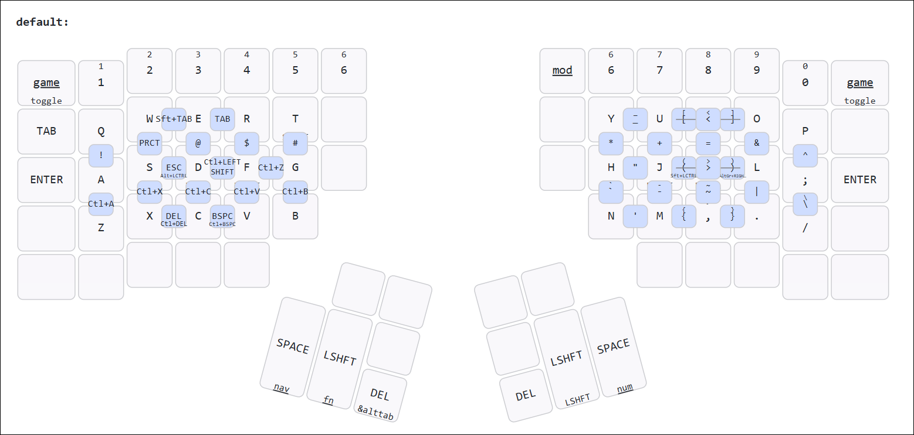
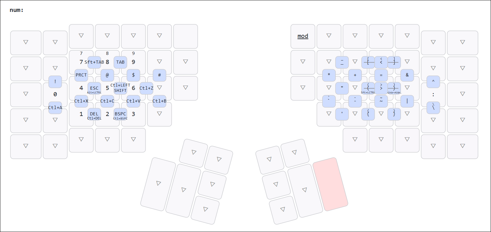
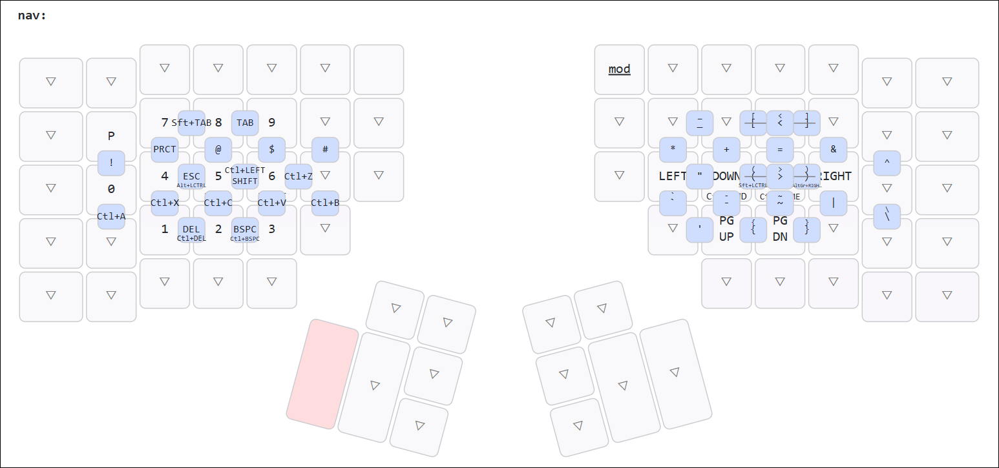

# Custom Kinesis Advantage 360 Pro Configuration

My customized ZMK configuration for the Kinesis Advantage 360 Pro.

## Keymap Visualization

**[View Interactive Keymap](https://keymap-drawer.streamlit.app/?zmk_url=https%3A%2F%2Fgithub.com%2FGreg-T8%2FKinesis-Adv360Pro-ZMK%2Fblob%2Fmain%2Fconfig%2Fadv360.keymap)**

**Default layer** (with home row mods)

**Num Layer**

**Navigation Layer**

## Home Row Mods

The default layer uses home row mods on both hands:

**Left hand**

- `A` → GUI when held
- `S` → ALT when held
- `D` → CTRL when held
- `F` → SHIFT when held

**Right hand**

- `J` → SHIFT when held
- `K` → CTRL when held
- `L` → ALT when held
- `;` → GUI when held

**Timing**

- Tapping term: 280ms
- Prior idle requirement: 170ms (left), 250ms (right)
- Quick tap: 150ms
- Hold-trigger-on-release enabled for smooth modifier combinations

## Flashing the Firmware

Follow the programming instructions on page 8 of the [Quick Start Guide](https://kinesis-ergo.com/wp-content/uploads/Advantage360-Professional-QSG-v8-25-22.pdf).

1. Extract the firmware from the GitHub Actions build artifact (cloud build) or the `firmware/` folder (local build).
2. Connect the left side keyboard to USB.
3. Press Mod+macro1 to put the left side into bootloader mode; it attaches as a USB drive.
4. Copy `left.uf2` to the USB drive; it will disconnect.
5. Power off both keyboards (unplug them and switch off).
6. Turn on the left side keyboard with the switch.
7. Connect the right side keyboard to USB to power it on.
8. Press Mod+macro3 to put the right side into bootloader mode.
9. Copy `right.uf2` to the mounted drive.
10. Unplug the right side keyboard and turn it back on.
